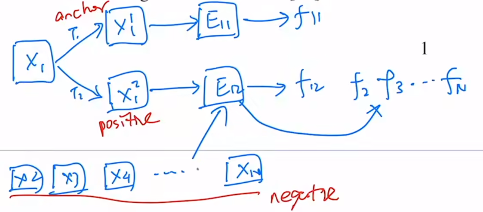

## 关于MoCo的琐碎

### 1. Abstract

#### 1.1. MoCo的counterpart

counterpart指的是使用相同的网络(e.g. Res50), 仅仅是训练方法不一样(supervision / self-supervison)。

#### 1.2. Downstream tasks

Transfer well. Outperform its supervised pre-train counterpart in 7 detection/segmentation task on PASCAL VOC, COCO and other dataset.(sometimes even surpassing it by large margins)

第一个在如此多的下游主流任务中表现如此好的无监督模型。

### 2. Introduction

#### 2.1. Compare to NLP

NPL的组成是离散的语义空间（词），语义信息明显，易于tokenize，通过字典进行建模，易于训练和优化

CV的组成是连续且高维的空间，语义信息不明显，不容易通过字典进行建模，故CV方向的无监督学习进展缓慢。

